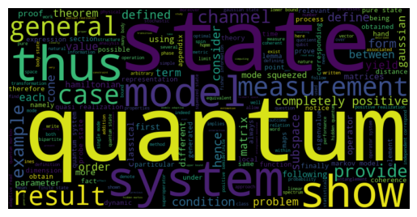

# MyResearch web scaper
This tool allows you to download from [arXiv.org](https://arxiv.org/) the body of your research and extract insights about it.

## Command line interface
A command line interface is available with the `myresearch` script
```
$ myresearch --help
usage: myresearch [-h] (--name NAME | --query QUERY) [--limit LIMIT] [--path PATH] [--wordcount WORDCOUNT] [--wordcloud WORDCLOUD]

A tool to scrape and summarize a your research papers

options:
  -h, --help            show this help message and exit
  --limit LIMIT         Maximum number of papers to use (default: inf)
  --path PATH           Path to use for storage (default: ./data)
  --wordcount WORDCOUNT
                        destination file for wordcount
  --wordcloud WORDCLOUD
                        destination file for word cloud. Format is inferred from the extension (png is recommended)

One of these arguments are required, but not both:
  --name NAME           Search name
  --query QUERY         Full query string
```

so for example
```bash
$ myresearch --name monras --wordcloud wc.png
Wordcloud written to wc.png
```

this generates the file `wc.png` in the local directory:


## Web server
This project can be hosted as a web service. For this, after installing, just run 
```
$ uvicorn myresearch.server:app --reload
INFO:     Will watch for changes in these directories: ['/Users/amonras/PycharmProjects/my-research']
INFO:     Uvicorn running on http://127.0.0.1:8000 (Press CTRL+C to quit)
INFO:     Started reloader process [90101] using WatchFiles
INFO:     Started server process [90103]
INFO:     Waiting for application startup.
INFO:     Application startup complete.
```
to launch the server. 
## Notes:
At the moment only word count and wordcloud is available.
At the moment only the first arxiv page will be scrapped.

## Installation
Just download the repo and 
```
pip install src/
```
